<a href='https://ko-fi.com/U7U1R0IQA' target='_blank'></a>

# Huawei Solar - PEES

Power, Energy and Economy Sensors<br>

## Project Description

This project will provide you with a set of custom sensors to be used in Home Assistant. These custom sensors will calculate all the power and energy flows of your Huawei Solar PV installation with a Battery. On top of this the provided sensors will calculate expenses with and without solar PV and the Net Return of your Investment (NRI) - this will give you a fairly exact idea about the profitability of your investment.

This README includes an explanation of the provided custom sensors and a guide on how to set them up in Home Assistant.

The provided custom sensors are based on a Huawei setup with 2 inverters and a battery. This is reflected throughout this readme. The custom sensors are now also available as a package and there is a package for a setup with one inverter as well as a setup with two inverters. See more about this in chapter 3. Installation.

## Table of Content

1. [Before You Start](#1-before-you-start)
2. [Flow and Definitions](#2-flow-and-definitions)
3. [Installation](#3-installation)<br>
   3.1 [Power Sensors](#31-power-sensors)<br>
   3.2 [Add power sensors to the Dashboard](#32-add-power-sensors-to-the-dashboard)<br>
   3.3 [Energy sensors](#33-energy-sensors)<br>
   3.4 [Alternative - Create the energy sensors with "Helpers"](#34-alternative---create-the-energy-sensors-with-helpers)<br>
   3.5 [Electricity tariffs and sales price](#35-electricity-tariffs-and-sales-price)<br>
   3.6 [Economy figures](#36-economy-figures)<br>
   3.7 [PV Economy](#37-pv-economy)<br>
   3.8 [Utility Meters - Optional](#38-utility-meters---optional)<br>
4. [Sensors for the Energy Dashboard](#4-sensors-for-the-energy-dashboard)
5. [Views and cards](#5-views-and-cards)
6. [Known "bugs"](#6-known-bugs)
7. [Thanks to](#7-thanks-to)

## 1. Before You Start

The custom sensors are all based on only 3 of the power sensors provided by the "Huawei Solar" custom integration by wlcrs - so the margin for error is minimized. You also need a sensor to provide you with the current electrical spot price. I use the "Energi Data Service" custom integration provided by MTrab. The following custom integrations need to be installed in Home Assistant before you start. Both of the integrations can be installed via HACS.

- **Huawei Solar** integration by wlcrs <https://github.com/wlcrs/huawei_solar>
- **Energi Data Service** integration by MTrab (or similar integration to fetch the current electricity price incl. VAT and tariffs) <https://github.com/MTrab/energidataservice>

You also need an editor in Home Assistant to be able to edit your configurations.yaml file. I use Studio Code Server (Visual Studio Code) as an Add-on in Home Assistant.

Please note that "this" is not an integration, this is "just" some custom sensors I share. Please also note the number of custom sensors provided. You should consider splitting up your configuration.yaml file.

> :bulb: **Please create a full backup before You start! This way You can easily reverse any mistakes or errors.**

## 2. Flow and Definitions

The diagram below shows the definitions used for the power- and energy-flows between the Solar PV, House, Battery, and Grid. These definitions are used in the naming convention for the custom sensors etc. The diagram is pretty straightforward but take a moment to study it to get acquainted with the definitions used.

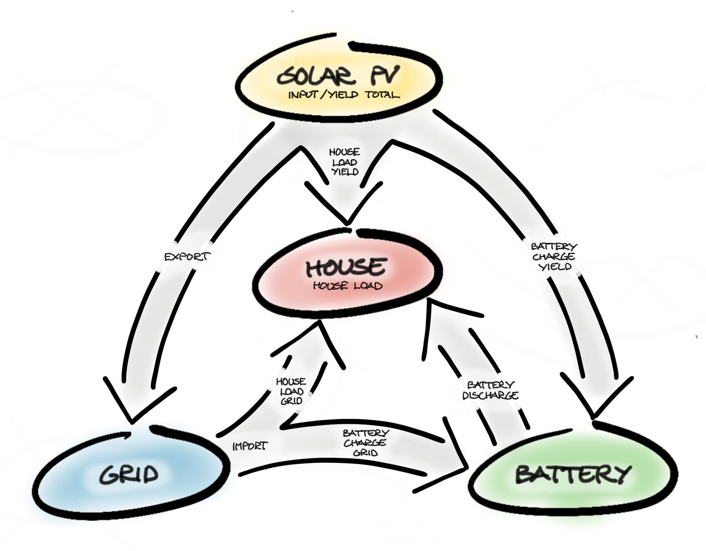

## 3. Installation

Generally, it may take a little while before sensors register any activity / change and therefore initially will have the status "Unavailable" or "Unknown" - so don't panic, be patient for the values to show.

#### Alternative installation

As an alternative to this instruction and steps in this document, the sensors are also available as a package (a single file) in the package folder - both for a setup with two inverters as this readme describes and for a setup with one inverter. Link to the package file [huawei_solar_pees](packages/huawei_solar_pees.yaml) This package does not include the sensor "Tariff Export" in chapter 3.5 and the sensor "Energi Data Service - Negativ" in chapter 4. These sensors are not needed for the provided custom sensors to work. The package file includes a short instruction.

### 3.1. Power Sensors

First of all, you have to create the following template sensors to track the power flows. Copy the custom sensors from the file "1_power_sensors.yaml" to "template: > sensor:" in your configuration.yaml file.

```yaml
template:
  - sensor:
```

Link to the power sensors [1_power_sensors.yml](1_power_sensors.yaml)

| Name                                                               | Description                                                                                                                                                                                                                     |
| ------------------------------------------------------------------ | ------------------------------------------------------------------------------------------------------------------------------------------------------------------------------------------------------------------------------- |
| Power Inverter #1 Input <br />sensor.power_inverter_1_input        | The power generated by inverter #1.                                                                                                                                                                                             |
| Power Inverter #2 Input <br />sensor.power_inverter_2_input        | The power generated by inverter #2.                                                                                                                                                                                             |
| Power Inverter Input Total <br />sensor.power_inverter_input_total | Sum of the power inverter input sensors (not in use at the moment but may come in handy). Note that it is not the power sensors with loss which can be created according to the documentation for the Huawei Solar integration. |
| Power House Load <br />sensor.power_house_load                     | The power used in the house, including power from solar PV, grid and battery. This would be the power imported without solar PV.                                                                                                |
| Power Export Grid <br />sensor.power_export_grid                   | The sum of power imported from grid. This includes power used in the house and power for charging the battery.                                                                                                                  |
| Power Battery Charge <br />sensor.power_battery_charge             | The total sum of power used to charge the battery.                                                                                                                                                                              |
| Power Battery Discharge <br />sensor.power_battery_discharge       | Power discharged from the battery and used in the house.                                                                                                                                                                        |
| Power Battery Charge Grid <br />sensor.power_battery_charge_grid   | Power imported from grid to charge the battery.                                                                                                                                                                                 |
| Power Battery Charge Yield <br />sensor.power_battery_charge_yield | Power generated by the solar PV used to charge the battery.                                                                                                                                                                     |
| Power House Load Grid <br />sensor.power_house_load_grid           | Power imported from grid and used in the house.                                                                                                                                                                                 |
| Power House Load Yield <br />sensor.power_house_load_yield         | Power produced by the the solar PV and used in the house.                                                                                                                                                                       |

> :bulb: **Restart Home Assistant and refresh your browser!**

### 3.2. Add power sensors to the Dashboard

Next, add the power sensors to a view in Your dashboard. This view will probably not have so much value in regards to the presentation of data, but it is an essential tool to make sure that the power sensors are getting the correct reading from the Huawei Solar integration. Creating dashboards and views is beyond this guide.

Copy the code under [Power Sensors Card](#power-sensors-card) from Chapter 5 into a manual card in a new view in your dashboard.

### 3.3. Energy sensors

The transformation of the power sensors to sensors with measurable energy (in kWh) is done with the help of the "Riemann sum integral sensor" in Home Assistant. This may cause some minor deviations e.g., compared to your energy meter and / or your energy bill from your electricity provider, but is the best method without a dedicated energy meter.

The energy sensors can either be created as platform sensors in your configuration.yaml file or as "Helpers" in the GUI. In chapter 3.4 it is described how to do this in the GUI.

Continue here if you wish to use the custom platform sensors provided. Copy the sensors from the file "2_energy_sensors.yaml" to "sensor:" in your configuration.yaml file. Note that these sensors are platform sensors (do not put them under "template: > sensor:"). Platform sensors require a restart to commit changes. The sensor for total yield will be created separately.

```yaml
sensor:
```

Link to the energy sensors [2_energy_sensors.yml](2_energy_sensors.yaml)

| Name                                                                  | Description                                                                                                                                                                          |
| --------------------------------------------------------------------- | ------------------------------------------------------------------------------------------------------------------------------------------------------------------------------------ |
| Energy Battery Charge <br />sensor.energy_battery_charge              | The total amount of energy used to charge the battery.                                                                                                                               |
| Energy Battery Charge Grid <br />sensor. energy_battery_charge_grid   | Energy imported from grid to charge the battery.                                                                                                                                     |
| Energy Battery Charge Yield <br />sensor. energy_battery_charge_yield | Energy generated from the solar PV and used to charge the battery.                                                                                                                   |
| Energy Battery Discharge <br />sensor. energy_battery_discharge       | Energy discharged from the battery and used in the house.                                                                                                                            |
| Energy Export <br />sensor. energy_export                             | Energy generated from the solar PV and exported to the grid.                                                                                                                         |
| Energy House Load <br />sensor. energy_house_load                     | The total energy used in the house, including energy from solar PV, grid and battery. This corresponds to the amount of energy You would have to import (buy) without Your solar PV. |
| Energy House Load Grid <br />sensor. energy_house_load_grid           | Energy imported from grid and used in the house.                                                                                                                                     |
| Energy House Load Yield <br />sensor. energy_house_load_yield         | Energy generated from the solar PV and used in the house.                                                                                                                            |
| Energy Yield #1 <br />sensor.energy_yield_1                           | The energy yield from inverter #1.                                                                                                                                                   |
| Energy Yield #2 <br />sensor.energy_yield_2                           | The energy yield from inverter #2.                                                                                                                                                   |
| Energy Yield Total <br />sensor.energy_yield_total                    | Sum of total energy yield from your inverters.                                                                                                                                       |

#### Energy Total Yield

The sensor for the total yield will be created as a sum of the energy yield from inverter #1 and #2 (do not use the sensor.power_inverter_input_total - I am not sure it will work properly with the cost calculations based on the Riemann integration). The total yield will be created as a template sensor. Copy the sensor below to "template: > sensor:" in your configuration.yaml file.

```yaml
template:
  - sensor:
```

```yaml
# Huawei Solar PEES - Energy Sensors
- name: 'Energy Yield Total'
  unique_id: energy_yield_total
  unit_of_measurement: kWh
  device_class: energy
  state_class: total_increasing
  state: >
    {{ states('sensor.energy_yield_1') | float + 
    states('sensor.energy_yield_2') | float }}
  availability: >
    {{ has_value('sensor.energy_yield_1') and 
    has_value('sensor.energy_yield_2') }}
```

To avoid errors in the utility meter readings when the inverters become unavailable, the energy sensor has been provided with an availability sensor.

> :bulb: **Restart Home Assistant and refresh Your browser!**

#### Adjust output

You can now go to "Developer tools" / "States" and find your newly added sensors, click on the "i", then click on the "cogwheel" and adjust "Display precision" and "Icon" to your liking (adjusting the precision of the sensor in the configuration.yaml file instead of "here", will affect the accuracy of the result).

### 3.4. Alternative - Create the energy sensors with "Helpers"

You can skip this chapter if you have already created the energy sensors according to chapter 3.3. If you decide to use "Helpers", please note that I have not tested them in the Home Assistant Energy Dashboard (see chapter 4).

From each of the power sensors, you have to create a corresponding energy sensor to track the energy flow in kWh. This is done by using "Helpers". In Home Assistant, go to "Settings" / "Devices & Services" / "Helpers" and click on "Create Helper" and choose "Integration - Riemann sum integral sensor".

Use the same naming convention as for the power sensor, just replace "Power" with "Energy" (see the table in chapter 3.3). Search for the correct corresponding power sensor in the field "Input sensor". The energy sensors should be created with the following settings.

- Integration method: Left Riemann sum
- Precision: 3
- Metric prefix: k (kilo)
- Time unit: Hours

#### Energy Total Yield

If you have more than one inverter, you should create one sensor for each inverter. Create the sensor for "Energy Total Yield" as described above in chapter 3.3.

> :bulb: **Restart Home Assistant and refresh Your browser!**

#### Adjust output

Go to "Settings" / "Devices & Services" / "Helpers", click on your newly added sensors, then click on the "cogwheel" and adjust "Display precision" and "Icon" to your liking.

### 3.5. Electricity tariffs and sales price

Most likely the price you pay for the purchase of electricity is not the same as you get for the sale of electricity - hence you need to create two sensors, one for purchase and one for sale.

#### Electricity purchase

First of all, we need to create a sensor for the price of purchased electricity with the same name used in the provided custom sensors. Go to "Developer tools" / "States" / "Energi Data Service" and create a new entry named "Energi Data Service" with the entity id "sensor.energi_data_service".

#### Tariffs on sale and export

When you have created a sensor for the price of purchase of electricity, you need to figure out how much you are paying for the sale and export of electricity. You can use the custom template sensor below, to add op the tariff costs specific for your case. This custom sensor can also be used in other scenarios (e.g., limiting sales when price is negative) - but you do not need this sensor for this "setup". If you wish, copy the sensor below to "template: > sensor:" in your configuration.yaml file.

```yaml
template:
  - sensor:
```

I'm sorry I intended to keep this in English but it slipped at this point.

```yaml
# Huawei Solar PEES - Spotprice and Tariffs
- name: 'Tariff Export'
  unique_id: tariff_export
  unit_of_measurement: DKK/kWh
  state: >-
    
    
    
      
      {{ (
      energinet_indfoedningstarif + 
      energinet_balancetarif + 
      konstant_indfoedningstarif + 
      jyskenergi_balancetarif 
      ) / 100 }}
```

Correct the four tariffs that are constants, enclosed with , to fit your situation. Note that the price is in "øre pr. kWh". If you change the "set name", you also have to change the name in the formula enclosed by the {{ "the double curly brackets" }}. Take care not to change the spacing to the left margin.

Go to "Developer tools" / "States", find the sensor and note down the cost you have to pay for the sale and export of the electricity you produce.

#### Electricity sale and export

Now you will add an entry for your "sales price". Go to "Settings" / "Energi Data Service" and click on "Add Entry" and create a new entry named "Energi Data Service - Salg" with the entity id "sensor.energi_data_service_salg"

- Choose your "Price Area" (East or West)
- Remove the tick in "Show prices including VAT"
- In "Template for additional cost" you add your tariff costs (calculated above) with a minus and in the format required e.g., {{ -0.0354 | float }}.

If you wish you can add another entity showing the "spotprice" in the same way, just without any additional cost.

> :bulb: **Restart Home Assistant and refresh Your browser!**

That's it. You now have an entity showing the price you get for selling 1 kWh at the current hour. Go to "Developer tools" / "States", find the sensor and check that the price is correct (spotprice - tariffs).

### 3.6. Economy figures

Tto convert the result from the custom energy sensors, into actual economy figures you have to use the triggered sensor created and provided by KennethLavrsen in this post in the Home Assistant community. You do not need to read / know / copy anything from this thread. Everything is "baked" into the custom sensors provided.

https://community.home-assistant.io/t/nordpool-integration-setup-of-sensor-for-denmark-with-3-tarif-rates-per-day-changing-month-by-month/521183/54

Copy the triggered sensors from the file "3_economy_sensors.yaml" to "template:" in your configuration.yaml file. Note that these are template trigger sensors (do not put them under "template: > sensor:").

```yaml
template:
```

Link to the economy sensors [3_economy_sensors.yml](3_economy_sensors.yaml)

| Name                                                               | Description                                                                                                                                 |
| ------------------------------------------------------------------ | ------------------------------------------------------------------------------------------------------------------------------------------- |
| Battery Charge Grid - Cost <br />sensor.battery_charge_grid_cost   | Cost related to charging the battery directly from grid.                                                                                    |
| Battery Charge Yield - Sale <br />sensor.battery_charge_yield_sale | "Lost revenue" due to charging the battery with yield from the solar PV (which otherwise could have been exported and generated a revenue). |
| Battery Discharge - Saving <br />sensor.battery_discharge_saving   | Savings related to usage of the battery to cover house loads.                                                                               |
| Export - Income <br />sensor.export_income                         | Income related to export of yield from the solar PV.                                                                                        |
| Import - Cost <br />sensor.import_cost                             | Costs related to purchase of electricity from grid. This includes electricity to cover house loads and charging of the battery.             |
| House Load - Cost <br />sensor.house_load_cost                     | The house load which without yield from a solar PV, should have been purchased from grid.                                                   |
| House Load Grid - Cost <br />sensor.house_load_grid_cost           | The part of the house load which is covered by purchase from grid.                                                                          |
| House Load Yield - Saving <br />sensor.house_load_yield_saving     | The part of the house load which is covered by the yield from the solar PV.                                                                 |

#### Utility meters tracking the Economy sensors

Since the sensors above return delta values, you need to create a utility meter for each of the sensors to get an absolute value. I suggest you create a separate file for your utility meters to not clutter your configuration. yaml file up too much.

Create a new yaml file named "utility_meters.yaml" and add "utility_meter: !include utility_meters.yaml" in your configuration.yaml file.

```yaml
utility_meter: !include utility_meters.yaml
```

Copy the utility meters from the file "4_utility_metres.yaml" to your utility_meters.yaml file. Note that these utility meters do not reset. Keep them separated.

Link to the utility metres [4_utility_meters.yml](4_utility_meters.yaml)

> :bulb: **Restart Home Assistant and refresh Your browser!**

### 3.7. PV Economy

The next step is to add some template sensors which can help you to track and evaluate the profitability and economic return on your solar PV investment. Copy the template sensors from the file "5_pv_economy_sensors.yaml" to "template: > sensor:" in your configuration.yaml file.

```yaml
template:
  - sensor:
```

Link to the PV Economy sensors [5_pv_economy_sensors.yml](5_pv_economy_sensors.yaml)

To be able to follow these figures regularly I have created so, you can copy the utility meters provided in the "6_pv_economy_utility_meters.yaml" file to your "utility_meters.yaml" or "configuration.yaml" file (depending on where you keep your utility meters).

Link to the PV Economy utility meters [6_pv_economy_utility_meters.yml](6_pv_economy_utility_meters.yaml)

> :bulb: **Restart Home Assistant and refresh Your browser!**

### 3.8. Utility Meters - Optional

As a final input, I have included a set of hourly, daily, monthly, quarterly and yearly utility meters for all of the energy and cost sensors. Copy the sensors you wish to have from the "7_utility_meters_optional.yaml" file to your "utility_meters.yaml" / "configuration.yaml" file (depending on where you keep your utility meters).

Link to the optional utility metres [7_utility_meters_optional.yml](7_utility_meters_optional.yaml)

> :bulb: **Restart Home Assistant and refresh Your browser!**

## 4. Sensors for the Energy Dashboard

The custom energy sensors created as platform sensors according to chapter 3.3 can be used directly in the Home Assistant Energy Dashboard. I have not tested if the sensors created as Helpers in the GUI can be used in the Home Assistant Energy Dashboard.

Do pay attention to that adding costs to sensors on the energy dashboard will create sensors with very similar naming to the names used in this setup.

If you would like to keep track of the savings you have from discharging of your battery, you can add the battery as a Gas or Water consumption. But you would need to multiply it with a negative price since it is a saving and not a cost. The best way to do this is by creating a negative price sensor. Copy the sensor below to "template: > sensor:" in your configuration.yaml file and use it for calculating the savings.

```yaml
template:
  - sensor:
```

```yaml
# Huawei Solar PEES - Spotprice and Tariffs
- name: 'Energi Data Service - Negativ'
  unique_id: energi_data_service_negativ
  unit_of_measurement: DKK/kWh
  state: >-
    {{ states('sensor.energi_data_service') | float(0) * (-1) }}
```

> :bulb: **Restart Home Assistant and refresh Your browser!**

## 5. Views and cards

> :bulb: **Under development! Please feel free to share your input.**

### Power Sensors Card

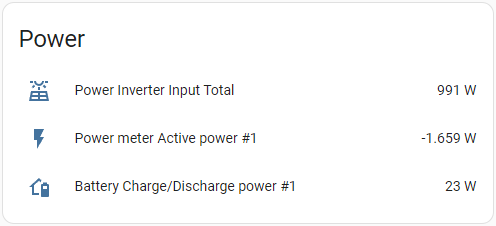
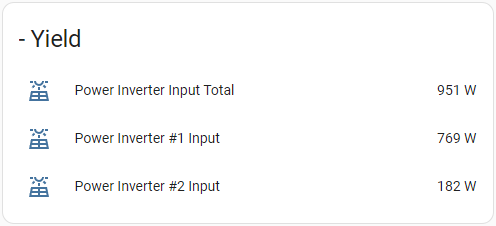
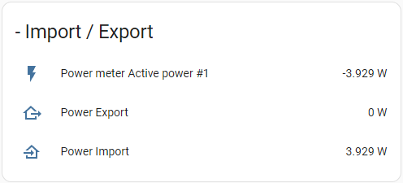

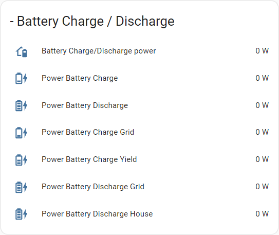

```yaml
square: false
type: grid
cards:
  - type: vertical-stack
    cards:
      - type: entities
        entities:
          - entity: sensor.power_inverter_input_total
          - entity: sensor.power_meter_active_power_1
          - entity: sensor.battery_charge_discharge_power_1
        title: Power
      - type: entities
        entities:
          - entity: sensor.power_inverter_input_total
          - entity: sensor.power_inverter_1_input
          - entity: sensor.power_inverter_2_input
        title: '- Yield'
      - type: entities
        entities:
          - entity: sensor.power_meter_active_power_1
          - entity: sensor.power_export
          - entity: sensor.power_import
        title: '- Import / Export'
      - type: entities
        entities:
          - entity: sensor.power_house_load
          - entity: sensor.power_house_load_yield
          - entity: sensor.power_house_load_grid
          - entity: sensor.power_battery_discharge
        title: '- House Load'
      - type: entities
        entities:
          - entity: sensor.battery_charge_discharge_power_1
          - entity: sensor.power_battery_discharge
          - entity: sensor.power_battery_charge
          - entity: sensor.power_battery_charge_grid
          - entity: sensor.power_battery_charge_yield
        title: '- Battery Charge / Discharge'
columns: 1
```

### Energy Sensors Card

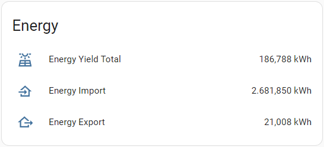
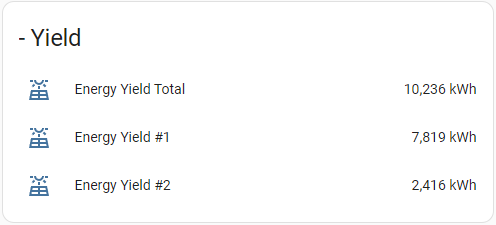
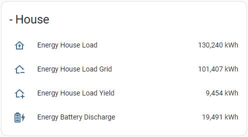
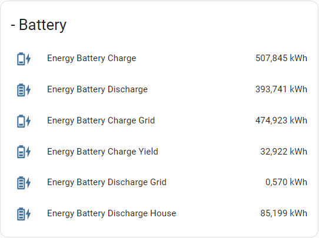

```yaml
square: false
type: grid
cards:
  - type: vertical-stack
    cards:
      - type: entities
        entities:
          - entity: sensor.energy_yield_total
          - entity: sensor.energy_import
          - entity: sensor.energy_export
        title: Energy
      - type: entities
        entities:
          - entity: sensor.energy_yield_total
          - entity: sensor.energy_yield_1
          - entity: sensor.energy_yield_2
        title: '- Yield'
      - type: entities
        entities:
          - entity: sensor.energy_house_load
          - entity: sensor.energy_house_load_grid
          - entity: sensor.energy_house_load_yield
          - entity: sensor.energy_battery_discharge
        title: '- House'
      - type: entities
        entities:
          - entity: sensor.energy_battery_discharge
          - entity: sensor.energy_battery_charge
          - entity: sensor.energy_battery_charge_grid
          - entity: sensor.energy_battery_charge_yield
        title: '- Battery'
columns: 1
```

### Yield and Consumption Card

This card does require that you have the Multiple Entity Row card installed and I have added a status of my available battery capacity which I have not shared here.<br>

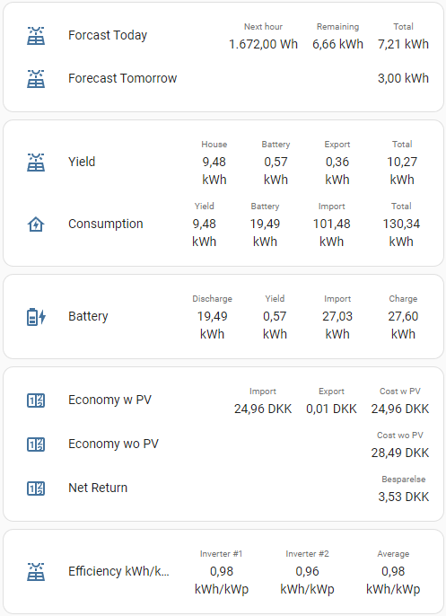

```yaml
square: false
type: grid
cards:
  - type: entities
    entities:
      - entity: sensor.energy_yield_total
        type: custom:multiple-entity-row
        icon: mdi:solar-power-variant-outline
        name: Yield
        state_header: Total
        secondary_info: false
        format: precision2
        entities:
          - entity: sensor.energy_house_load_yield
            name: House
            format: precision2
          - entity: sensor.energy_battery_charge_yield
            name: Battery
            format: precision2
          - entity: sensor.energy_export
            name: Export
            format: precision2
      - entity: sensor.energy_house_load
        type: custom:multiple-entity-row
        icon: mdi:home-lightning-bolt-outline
        name: Consumption
        state_header: Total
        secondary_info: false
        format: precision2
        entities:
          - entity: sensor.energy_house_load_yield
            name: Yield
            format: precision2
          - entity: sensor.energy_battery_discharge
            name: Battery
            format: precision2
          - entity: sensor.energy_house_load_grid
            name: Import
            format: precision2
    state_color: true
  - type: entities
    entities:
      - entity: sensor.energy_battery_charge
        type: custom:multiple-entity-row
        icon: mdi:battery-charging-medium
        name: Battery
        state_header: Charge
        secondary_info: false
        format: precision2
        entities:
          - entity: sensor.energy_battery_discharge
            name: Discharge
            format: precision2
          - entity: sensor.energy_battery_charge_yield
            name: Yield
            format: precision2
          - entity: sensor.energy_battery_charge_grid
            name: Import
            format: precision2
    state_color: true
  - type: entities
    entities:
      - entity: sensor.pv_economy_result_w_pv
        type: custom:multiple-entity-row
        name: Economy w PV
        secondary_info: false
        state_header: Cost w PV
        format: precision2
        entities:
          - entity: sensor.import_cost_2
            name: Import
            format: precision2
          - entity: sensor.export_income_2
            name: Export
            format: precision2
      - entity: sensor.pv_economy_result_wo_pv
        type: custom:multiple-entity-row
        name: Economy w PV
        secondary_info: false
        state_header: Cost w PV
        format: precision2
        entities:
          - entity: sensor.energy_house_load
            name: Consumption
            format: precision2
      - entity: sensor.pv_economy_nri_pv
        type: custom:multiple-entity-row
        name: Net Return
        secondary_info: false
        state_header: NRI Total
        format: precision2
        entities:
          - entity: sensor.pv_economy_nri_battery
            name: NRI Battery
            format: precision2
    state_color: true
  - type: entities
    entities:
      - entity: sensor.energy_yield_total_pr_kwp
        type: custom:multiple-entity-row
        name: Efficiency kWh/kWp
        secondary_info: false
        state_header: Average
        format: precision2
        entities:
          - entity: sensor.energy_yield_1_pr_kwp
            name: 'Inverter #1'
            format: precision2
          - entity: sensor.energy_yield_2_pr_kwp
            name: 'Inverter #2'
            format: precision2
columns: 1
```

### Net Return on Investment Card

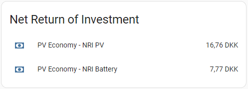
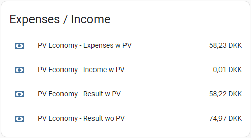

```yaml
square: false
type: grid
cards:
  - type: entities
    entities:
      - sensor.pv_economy_expenses_w_pv
      - sensor.pv_economy_income_w_pv
      - sensor.pv_economy_result_w_pv
      - sensor.pv_economy_result_wo_pv
    title: Expenses / Income
  - type: entities
    entities:
      - sensor.pv_economy_nri_pv
      - sensor.pv_economy_nri_battery
    title: Net Return of Investment
columns: 1
```

## 6. Known "bugs"

None at the moment.

## 7. Thanks to

**A huge thanks to;**

- **wlcrs** for providing the "Huawei Solar" integration. This integration is essential for anyone who wishes to integrate their Huawei Solar PV in Home Assistant.

- **MTrab** for providing the "Energi Data Service" integration. This integration is essential for all of us trying to keep up with the electricity prices and the complex and ever-changing tariffs in DK.

- **KennethLavrsen** for providing the full input for the triggered template sensors used to convert the Riemann Sum into actual economical figures.

**Again, Thank You to all of You!**
