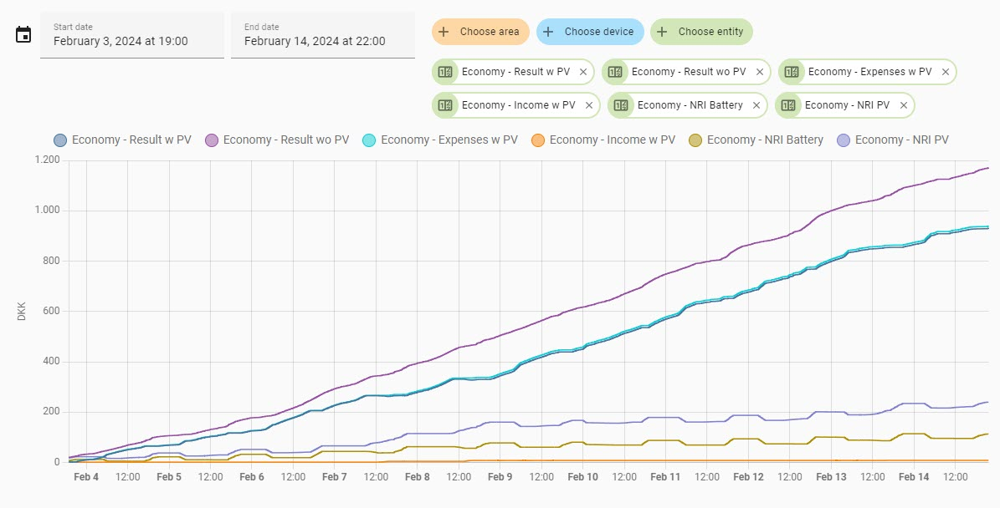

<a href='https://ko-fi.com/U7U1R0IQA' target='_blank'></a>

# Huawei Solar - PEES

**Power, Energy and Economy Sensors**

## Project Description

This project will provide you with a set of custom sensors to be used in Home Assistant also referred to as the *"Huawei Solar PEES package"*. These custom sensors will calculate all the power and energy flows of your Huawei FusionSolar PV installation with Battery (without the corrections we see in FusionSolar). On top of this the provided sensors will calculate expenses with and without solar PV and the Net Return of Investment (NRI) - this will give you a fairly exact idea about the profitability of your investment in several aspects.

This README guides you through a simple installation and setup process. For an overview and a more detailed description of the sensors included in the *"Huawei Solar PEES package"*, please refer to the [Wiki Pages](https://github.com/JensenNick/huawei_solar_pees/wiki). The experienced Home Assistant user may find this guide banal - but this is to include all users, also the ones just starting out.



> *Economy Sensors. Track your solar PV investment, compare it to what your economy would have been without solar PV, and track the net retur of your investment.*

The provided custom sensors are based on a setup with two inverters and one battery. This is reflected throughout this README and the [Wiki Pages](https://github.com/JensenNick/huawei_solar_pees/wiki). The custom sensors are available as a package for an easy "installation". See more about this in chapter 3. Installation.

## Table of Content

1. [Before You Start](#1-before-you-start)
2. [Flow and Definitions](#2-flow-and-definitions)
3. [Installation](#3-installation)<br>
    3.1 [Package "Installation"](#31-package-installation)<br>
    3.2 [Power Input](#32-power-input)<br>
    3.3 [Eletricity Price](#33-electricity-price)
4. [Specific Input Settings (optional)](#4-specific-input-settings-optional)<br>
    4.1 [Efficiency Corrected Power Input](#41-efficiency-corrected-power-input)<br>
    4.2 [Electricity Price](#42-electricity-price)<br>
    4.3 [Extras](#43-extras)<br>
5. [Known "bugs"](#5-known-bugs)
6. [Thanks to](#5-thanks-to)

## 1. Before You Start

The custom sensors in the *"Huawei Solar PEES package"* are all based on only three types of power sensors provided by the *"Huawei Solar integration by wlcrs"* - this makes these custom sensors robust and the margin for error is minimized. You also need sensors to provide you with current electrical prices. I use the *"Energi Data Service integration by MTrab"*. These two custom integrations needs to be installed in Home Assistant before you start. Both of the integrations can be installed via HACS.

- **Huawei Solar** integration by wlcrs <https://github.com/wlcrs/huawei_solar>
- **Energi Data Service** integration by MTrab (or similar integration e.g. Nordpool, to fetch the current electricity price incl. VAT and tariffs) <https://github.com/MTrab/energidataservice>

You also need an editor in Home Assistant to be able to edit your configuration.yaml file. I use Studio Code Server (Visual Studio Code) as an Add-on in Home Assistant.

Please note that the *"Huawei Solar PEES package"* is not an integration, it is a set of custom sensors I share. Please also note the number of custom sensors provided.

> :exclamation: **It is good practise always to create a full backup before you start** :exclamation:

## 2. Flow and Definitions

The diagram below shows the definitions used for the power- and energy flows between the Solar PV, House, Battery, and Grid. These definitions are used in the naming convention of the custom sensors included in the *"Huawei Solar PEES package"*. The diagram is fairly straightforward but take a moment to study it to get acquainted with the definitions used.


> ***In the [Wiki Pages](https://github.com/JensenNick/huawei_solar_pees/wiki) you will find an overview and a more detailed description of all sensors included in the "Huawei Solar PEES package".*** 

## 3. Installation

The custom sensors included in the *"Huawei Solar PEES package"* are available for download as two files, intended to be "installed" as a "package". You can read more about packages in the Home Assistant documentation [Packages](<https://www.home-assistant.io/docs/configuration/packages/>).

### 3.1 Package "Installation"

The "installation" is very straight forward. Each step is described in the bulleted list below. So just for the overview - the process includes configuring your configuration.yaml file, creating a directory/folder for the *"Huawei Solar PEES package"* files and copy/pasting the package files into the directory/folder you have created. The package files also includes similar short instructions.

* Open Studio Code Server (or your choise of code editor) and **ad the following two lines** to your `configuration.yaml` file.

```yaml
home assistant:
  packages: !include_dir_named packages
```

* **Create a directory/folder** named `packages` in the `CONFIG` directory/folder (the main directory/folder).
* **Copy/paste the package files** [*"huawei_solar_pees.yaml"*](packages/*"huawei_solar_pees.yaml"*) and ["**"huawei_solar_input.yaml*"](packages/"**"huawei_solar_input.yaml*") into your `packages` directory/folder.<br> The *"**"huawei_solar_input.yaml*"* file is necessarry although you do not wish to provide your own electricity price sensor or take advantage of the efficiency corrected input power sensor (see below), because of dependencies between the two files included in the "package".

> :bulb: ***That is it! That is all the "installation" you need to do** in order to be up and running with all the custom sensors included in the "Huawei Solar PEES package" - provided that you are using the default names for the input sensors.*

If you wish, you may alternatively download package file including the latest Release Note and supplemental documents like this README from the [Releases Page](https://github.com/JensenNick/huawei_solar_pees/releases), where you will also find previous releases.

#### Restart
Since the *"Huawei Solar PEES package"* includes platform sensors, "Restart Home Assistant" litrally means "Restart Home Assistant" (not "Quick Reload") and refresh your browser (use the browser refresh button or F5 on Windows / Cmd+Shift+R on Mac).

> :exclamation: **Restart Home Assistant and refresh your browser** :exclamation:

The energy and economy sensors require "activity" in order for it to start. It may take a little while before sensors register any activity/change and therefore will have the status "Unavailable" or "Unknown" initially - don't panic, be patient for the values to show. If you wish to force a sensor to start you may manually set it to "0" (zero). Please refer to the [Wiki Pages](https://github.com/JensenNick/huawei_solar_pees/wiki/5.-Dashboards,-Views-and-Cards#force-sensor-startup) where you will find a detailed guide on how to do this.

### 3.2 Power Input

My advice is to use the default names for the power input sensors from the *"Huawei Solar integration by wlcrs"*. If you for some reason do not wish to use the default names for the input sensor you need to make sure that the naming of your input sensors is correct.

The custom sensor in the package rely on the following power input sensors from the *"Huawei Solar integration by wlcrs"* `inverter_input_power` / `inverter_input_power_2` (if you have two inverters), `power_meter_active_power` and `battery_charge_discharge_power`. The naming used in the package file corresponds to this default naming used by the *"Huawei Solar integration"*.
 
If you for some reason do not wish to use the default names you need to edit the package file [*"huawei_solar_pees.yaml"*](packages/*"huawei_solar_pees.yaml"*). You will find the following text lines (# = text / not part of the code) which allows for an easy global edit or search/replace.

```yaml
# - 'sensor.inverter_input_power' (from the Huawei Solar integration)
# - 'sensor.power_inverter_2_input' (from the Huawei Solar integration)
# - 'sensor.power_meter_active_power' (from the Huawei Solar integration)
# - 'sensor.battery_charge_discharge_power' (from the Huawei Solar integration)
 ```

### 3.3 Electricity Price
My advice is to stick with the defaul names,
`sensor.energi_data_service` (price pr. kWh you pay for purchase/import) and `sensor.energi_data_service_sale` (price pr. kWh you receive for sale/export) used for the electricity price sensors. If you need helpt to set up the electricity price sensors in the *"Energi Data Service integration by MTrab"*, please refer to the [Wiki Pages](https://github.com/JensenNick/huawei_solar_pees/wiki/3.-Electricity-Tariffs-and-Price#energi-data-service-integration).

If you do not wish to use the default electricity price sensors from the *"Energi Data Service integration"* or if you wish to use a different sensor name, please refer to chapter 3.4 [Specific Settings (optional)](#34-specific-user-settings-optional).

### 3.4 Currency

You may need to correct the currency to your local currency. The currency used in the provided custom sensors is DKK (Danish Krone) and this is the price pr. kWh. This is a correction which also has to be done in the *"huawei_solar_pees.yaml"* file as a global edit or search/replace. 

## 4. Specific Input Settings (optional)

The *"Huawei Solar PEES package"* now include the [huawei_solar_input.yaml](packages/huawei_solar_input.yaml) file, and as the name suggests, this file contain sensors to be used for user specific input.

You should not edit file *"huawei_solar_input.yaml*" file. All user specific inputs are done via Lovelace / the GUI. The *"Huawei Solar PEES package"* also include the [huawei_solar_input_card.md](packages/huawei_solar_input_card.md) file. This file contain the code for the *"Huawei Solar PEES - Input Card"* for Lovelace / Home Assistant Dashboards. Here is a step by step instruction on how to "install" the "input card".

* **Create a new dashboard** (optional) in Home Assistant e.g. named "Solar PV".
* **Create a new view** (optional) in the new dashboard e.g. named "Input"
* **Add a new "Manual" card** in the new "Input" view.
* **Copy/paste the code** from the [huawei_solar_input_card.md](packages/huawei_solar_input_card.md) into the "Manual" card. Make sure to delete/overwrite the predefined text `type: ''` in the "Manual" card.
* **Click "Done" and refresh your browser.**

> :bulb: *You are now set up and able to adjust your user specific input settings!*

### 4.1 Efficiency Corrected Power Input

The default custom power input sensors do not take the inverter efficiency into account, which may result in a too high yield and other inaccuracies (house load is calculated on basis of the yield). The *"Huawei Solar integration"* does provide the `sensor.input_power_with_efficiency_loss` which takes the inverter efficiency into account. I have not tested this sensor, but my assessment is that it may cause inaccuracies and/or errors due to the step-by-step adjustment of the efficiency.

Therefore and as an option I have created two custom sensors - one for the Huawei SUN2000 3/4/5/6/8/10KTL-M1 (three phase) inverters and one for the Huawei SUN2000 2/3/3.68/4/4.6/5/6KTL-L1 (single phase) inverters. The sensors are basically created as f(x) functions based on the efficiency graphs shown in the data sheets provided by Huawei.


> *Efficiency corrected input power graphs - yield from each inverter and the total power yield.*

Here is a short description of how to set up and adjust your efficiency corrected power input sensor/sensors.

* **Toggle the on/off switch** to "on" for the type (single or three phase) inverter you have.<br>

* In the card that appear below, **chose the model** of your inverter in the drop down menu.<br>

* The slider for the **"Operating voltage" is used to adjust the efficiency** of the inverter. The rated voltage of your inverter, represents the voltage at which your inverter has the highest efficiency. For the Huawei SUN2000 3/4/5/6/8/10KTL-M1 (three phase) inverters, the rated voltage is 600 V. For the Huawei SUN2000 2/3/3.68/4/4.6/5/6KTL-L1 (single phase) inverters the rated voltage is 360 V.<br><br>
You can adjust the operating voltage slider within the operating range of your inverter. Any adjustmens made that deviates from the rated voltage will decrease the efficincy, but with slightly different profiles. The profiles used match the efficiency curves in the datasheet from Huawei. There is a linear interpoleration between the known values.<br><br>
You can use the "History" information in the FusionSolar app to set your approximate voltage. With more than one string you will have to estimate an average. The "goal" is not to set it "correct", because there is not one "correct" value. The "goal" is to set the operating voltage to a value, which will give you the most accurate energy output.<br>

* The slider for the **"Overall factor"** is a bit more straight forward. This slider will, as the name suggests, **increase or decrase the overall efficiency** of the efficiency corrected power input sensor. This is very powerfull and therefor the range of the slider is limited and the increments are small. Set to 100% the slider has no effect.

To simplify the differense between the two slides without getting to technical, think of the overall factor as a *"parrallel adjustment"* (up and down) of the efficiency curve, whereas the operating voltage is "adjusting the *"profile of the curve"* with some reduction of efficiency".


Please refer to the [Wiki Pages](https://github.com/JensenNick/huawei_solar_pees/wiki/1.-Power-Sensors#efficiency-corrected-inverter-power-sensors) for more information about how the efficiency corrected power input sensors have been created, how they work and how they should be adjusted to your specific use case.

### 4.2 Electricity Price

By default the *"Huawei Solar PEES package"* use two electricity price sensors from the *"Energi Data Service integration"*. If you use this dnd have named the sensors according to this README / the Wiki Pages, you do not need to do anything. The "text box" can be left with `unknown`, `unavailable` or ` ` (empty).

For those who use alternative electricity price sensors or sensor names, enter your sensor name in the "text box" and the calcolations made in the "HUawei Solar PEES package" will be based on those sensors. Rember to include `sensor.` in the name and do not include any type of brackets `"` or `'`.


You need to provide two electricity price sensors as input - one which provides the price you pay pr. kWh for import/consumption and one which provides the price pr. kWh that you receive for export/sale. The two sensors used in the *"Huawei Solar PEES package"* are from the *"Energi Data Service integration"* are `sensor.energi_data_service` and `sensor.energi_data_service_sale`. These are custom names that you can give the sensors when you add/create them as entities via the integration (as per above preferably before "intalling" the *"Huawei Solar PEES package"*).


> *Daily Battery Economy: Track your cost charging the battery from grid, lost revenue due to charging solar PV production and the savings you have discharging the battery.*

### 4.3 Extras

#### Battery and Solar Panels

The input file "**"huawei_solar_input.yaml*" and the code for the Lovelace Input Card huawei_solar_input_card.md does includes other user specific settings used by other packages either that I provide or intend to release soon. Settings for those inputs will be described in the README for those "packages". Battery and Solar Panels will be used for my *"Huawei Solar STAT package"* which will include statistics sensors.

#### Electricity Price for Energy Dashboard

First of all the the *"Huawei Solar - PEES package"* will do a much better job tracking your savings than the Energy Dashboard, so I would of course hope you will help with development of an alternative to the Energy Dashboard using the custom sensors provided in this "package". As of February 2024 the Energy Dashboard in Home Assistant does not support adding price sensors that calculate your savings from the consumption of energy either directly from the solar PV installation or from your battery.  The *"huawei_solar_input.yaml"* file include the `sensor.energi_data_service_negative` which may be used as a price sensor if you wish to set up either `sensor.energy_house_load_yield` and/or `sensor.energy_battery_discharge_house` as "Gas consumption" og "Water consumption" to track your savings.

### Tariffs

If you have several tariffs and/or it/they change from time to time, you might find it beneficial to have a sensor with the calculation of the "total" tariff for sale/export. In the *"huawei_solar_input.yaml"* you will find the `sensor.tariff_export` which you can use for this.

## 5. Known "bugs"

None at the moment.

## 6. Thanks to

**A huge thanks to;**

* **wlcrs** for providing the *"Huawei Solar integration"*. This integration is essential for anyone who wishes to integrate their Huawei Solar PV in Home Assistant.

* **MTrab** for providing the *"Energi Data Service integration"*. This integration is essential for all of us trying to keep up with the electricity prices and the complex and ever-changing tariffs in DK.

* **KennethLavrsen** for providing the full input for the triggered template sensors used to convert the Riemann Sum into actual economical figures.

* **All contributors** and especially **Krabbee** and **JacobsenKim**.

**Again, Thank You to all of You!**
